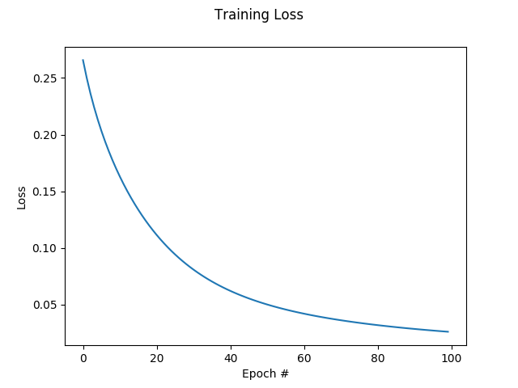
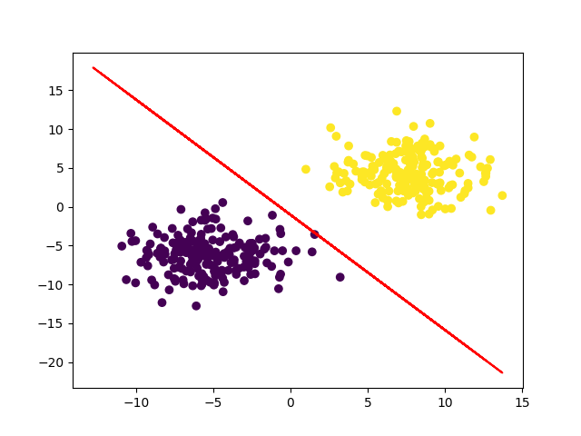

# SGD

Stochatic gradiant descent (SGD) Algorithm project for my engineering degree. 


## Prerequisites

You need to install few python libraries for set up the project.  

See the requirement.txt file and launch the following command : 

```
pip install -r requirements.txt
```

## Graphics 

By the way you can see two graphics here. 

One for the loss curve.  


And the other one for the regression.



